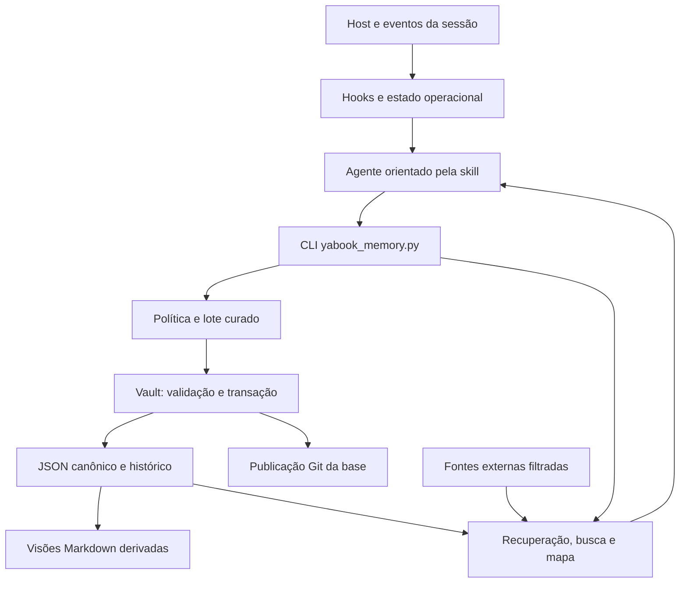

# Memória do YABook: uso e funcionamento

O YABook mantém uma base própria de conhecimento, em arquivos JSON legíveis e
versionados no repositório privado de cada pessoa. O agente interpreta a conversa,
avalia descobertas e prepara mudanças; os serviços do plugin validam o lote,
gravam pela política de aprendizado ou aprovação manual e publicam os arquivos
correspondentes. O aprendizado cotidiano não exige `do memory` por descoberta.

Comece pelo [manual de instalação](instalacao-plugin-yabook.md). Este guia cobre
o uso diário, organização, Git, colaboração, busca e visualização. Os exemplos
são ilustrativos, não documentação funcional de uma aplicação.

Para entender a implementação, consulte [Como funciona tecnicamente](#como-funciona-tecnicamente):
componentes, transações, hooks, busca e sincronização.

## O que guardar

Uma boa memória modifica uma decisão futura: onde investigar um comportamento,
qual contrato foi confirmado, em que condição um procedimento funciona ou por
que uma hipótese foi descartada. Inclua evidência, limite de aplicação e situação.

Não transforme toda conversa em memória. Logs, status transitório, tarefas
pendentes e descrições repetidas de commits geralmente pertencem à issue ou ao
histórico do projeto. Credenciais e autorizações de sessão não pertencem à base.
A detecção de padrões de segredo é uma ajuda, não substitui a revisão do conteúdo.

`add`, `edit` e `forget` passam pela curadoria do agente. Um pedido pode resultar
em adicionar, atualizar, relacionar, arquivar, remover, manter ou rejeitar. O
agente registra utilidade, motivo, evidência e aplicação no histórico. No fluxo
automático, a conversa recebe somente o aviso de atualização.

## Aprendizado automático

A política local `learning.mode: automatic` permite consolidar um lote de
aprendizados ao concluir uma etapa relevante, sem perguntas intermediárias.
O agente consulta apenas conhecimento relacionado, verifica utilidade, novidade,
evidência, escopo e conflitos e chama `learn`. Sem novidade útil, não grava nem
emite aviso. Não repetir a investigação nem reler toda a memória para aprender.

| Candidato | Destino no fluxo automático |
| --- | --- |
| Descoberta comprovada e complemento no projeto configurado | Aplicar com evidência e aplicação |
| Preferência declarada pela pessoa | Aplicar como explícita no escopo Pessoa |
| Hipótese durável, preferência inferida, duplicação ou conflito | Proposta pendente, sem aplicação |
| Incorporação de conteúdo de outra base | Proposta pendente, preservando origem |
| Arquivamento/superação com evidência | Aplicar preservando histórico |
| Exclusão definitiva ou escopo divergente | Proposta pendente, exige revisão |

O serviço não julga a verdade por conta própria. O agente faz a curadoria e
declara os conflitos encontrados; o runtime verifica estrutura, escopo, política,
evidências presentes e consistência da transação. Similaridade não confirma fatos.

Uma atualização bem-sucedida produz apenas `Memória atualizada: <assunto/arquivo>`.
O veredito completo fica no histórico, consultável com `memory recent`. Propostas
pendentes aparecem em `memory review`. Pendências
não geram perguntas durante o desenvolvimento; conflitos que afetem a tarefa e
falhas reais devem ser informados. Não anunciar publicação se houver `pending_push`.

Novas inicializações incluem a política automática no plano aprovado. Uma base
com configuração antiga sem `learning` permanece manual; habilite uma vez com
`$yabook do memory policy automatic`. Para desativar, use
`$yabook do memory policy manual`. A política persiste na máquina e não ativa o
modo operacional `auto`, nem autoriza Git do projeto ou migração nativa.

Cada checkpoint publica um lote, com uma transação e um commit/push em base Git;
não há publicação a cada mensagem. O próprio agente processa o checkpoint.
Não há trabalhador independente em segundo plano nesta versão: o hook solicita
a avaliação uma vez e evita repetição no encerramento.

## Organização: tipos e níveis de recuperação

A memória tem duas dimensões independentes: o tipo de informação e o nível de
detalhe necessário para executar a tarefa. O formato canônico atual é o schema 2.

| Tipo | Conteúdo | Coleção canônica |
| --- | --- | --- |
| `profile` | Idioma, áreas de trabalho e estilo de colaboração | `records` |
| `preference` | Comportamento desejado, explícito ou inferido, com aplicação | `records` |
| `procedure` | Forma aprendida de investigar, executar ou validar | `records` |
| `knowledge` | Fato, hipótese, decisão ou responsabilidade técnica | `records` |
| `project` | Índice estável de um projeto | `groups` |
| `topic` | Assunto que reúne conhecimentos e experiências | `groups` |
| `collection` | Agrupamento auxiliar, inclusive grupos antigos | `groups` |
| Entidade | Fonte, módulo, operação, tabela ou conceito | `entities` |
| Experiência | Relato compacto de uma tarefa e seus resultados | `episodes` |

Grupos por projeto e assunto apontam para os registros; não copiam suas
informações. `parent` liga grupos hierárquicos; ciclos e filhos fora do escopo
do pai são recusados. `members` pode reunir registros, entidades, grupos e
experiências. Um registro pode participar de mais de um assunto.

Use IDs estáveis para projetos, nomes relativos ao repositório para fontes e
componentes de escopo que funcionem em qualquer máquina. `project_id`, quando
informado, precisa apontar para um grupo `project` do mesmo escopo. Caminhos
absolutos dos checkouts ficam no mapa local de `projects` da configuração.

### Perfil, preferências e procedimentos

Registros usam `kind`. A ausência desse campo em uma base antiga significa
`knowledge`; o leitor não tenta inferir um perfil nem reescrever a origem.
Preferências têm `authority: explicit|inferred` e `activation: always|conditional`.
A aplicação permanente de preferências e procedimentos exige origem explícita.
Perfil confirmado e preferências próprias, explícitas, confirmadas e permanentes
entram no contexto inicial. Preferências condicionais e procedimentos são
indexados e consultados conforme a tarefa. `priority` é opcional, inteiro de
0 a 100; organiza a seleção dentro do orçamento, sem aumentar a confiança.

Regras normativas do método permanecem na skill, no arquivo de instruções e
nos hooks aplicáveis. Um procedimento aprendido não cria autorização nem vira
um bloqueio obrigatório por estar na memória. Dados de fontes conectadas podem
ser pistas; perfil e preferências pessoais do colaborador são excluídos da visão
aplicável, mesmo quando a política permitir ler o escopo pessoal.

### Assuntos, nomes e situações de aplicação

`keywords`, `aliases` e `triggers` são listas de textos pesquisáveis. Exemplo
fictício: um assunto de sincronização pode ter o alias “dados não chegaram” e
ligar a entidade `exemplo-sync.p` aos conhecimentos que explicam seu papel.
O nome do fonte é uma entidade; o assunto pode envolver vários fontes e camadas.
A associação e a responsabilidade precisam de evidência antes de confirmação.

Um resumo de grupo tem `summary_sources` com a revisão de cada membro. Se um
membro mudar, sair da visão ou tiver resumo desatualizado, o resumo dependente
não é usado como atual. Essa invalidação alcança os grupos ancestrais.
Na busca externa, filtros são aplicados antes da composição dos índices e
resumos, incluindo a retirada de vínculos e conteúdo agregado incompatível.

### Experiências de tarefas e evidências

Uma experiência preserva o contexto da descoberta: `objective`, `context`,
`actions` (lista), `outcome` e `validation` (lista). `learnings` referencia IDs
em `records`; registros podem apontar de volta por `episodes`. Não
copie conversas e logs integrais para o relato.

Cada evidência em `evidence` informa `type`, `ref`, `level` e, quando conhecida,
`date` (`AAAA-MM-DD`). O nível separa inspeção estática (`static`), teste
automatizado (`automated`), execução em APK/ERP/sistema (`runtime`), validação
manual (`manual`), declaração da pessoa (`statement`) e relato de sessão sem
reverificação (`reported`); um nível não substitui o outro. Tipos aceitos:
`code`, `commit`, `test`, `build`, `system`, `document`, `conversation` e `session`.

```json
{"type": "code", "ref": "fonte.p@abc1234", "level": "static", "date": "2026-01-15"}
```

Conteúdo migrado de outro agente registra `provenance` (`agent`, `file`, `lines`
opcional e `hash` SHA-256 do snapshot), separado de `origin`, que identifica a
base e o ID de origem. Referências a arquivos locais, como rollouts, podem não
existir em outra máquina; registre nelas o que foi verificado.

Bases antigas com evidência em texto continuam legíveis. O formato estruturado é
exigido quando o item é escrito novamente. Uma experiência confirmada exige
evidência; validação pendente deve permanecer explicitamente descrita.

O relato histórico não é automaticamente conhecimento vigente. Ao corrigir um
fato, atualize ou arquive o registro apropriado e preserve a experiência como
contexto histórico. O histórico em `history/` continua registrando as operações
de curadoria; é diferente das experiências em `episodes/`.

Atualizações enviam o valor completo do item. Omitir um campo existente exige
declará-lo em `remove_fields` na mudança; caso contrário, a proposta é recusada.
Ao alterar membros de um grupo com resumo, o resultado informa `stale_summaries`
para que o resumo seja revisto no mesmo lote ou em outro.

### Visões geradas e Git

Após uma aplicação autorizada pela política ou aprovada manualmente, o serviço gera:

- `views/memory_summary.md`: perfil, preferências, procedimentos e entrada para o índice.
- `views/MEMORY.md`: índice por escopo, tipo, situação e termos, apontando para os JSON.
- `views/topics/<id>.md`: resumo aprovado do grupo, vínculos e revisões.

Essas visões são derivadas, identificadas por hash e publicadas no mesmo commit
do conhecimento. Não as edite como fontes independentes. A geração reorganiza
os dados aprovados; não produz conclusões novas com um modelo. Um novo resumo
semântico exige curadoria e política aplicável ou aprovação manual. Só arquivos cujo conteúdo mudou são
reescritos; assuntos independentes conservam sua versão. Arquivos sem a marca
de geração e links simbólicos nos destinos são recusados.

### Recuperação progressiva

Na abertura da sessão, o plugin entrega perfil, preferências permanentes e um
índice do escopo pessoal e do projeto. O resultado respeita um orçamento e
mantém JSON válido: itens que não cabem ficam para consulta, com `truncated`.
Ao receber a tarefa, o hook consulta assuntos e conhecimento pertinente,
incluindo preferências condicionais que correspondem aos termos da mensagem.
Não carrega experiências ou evidências extensas por padrão. O plugin registra,
por sessão, cada item entregue com revisão e nível (índice, conhecimento ou
evidência) e não reenvia o mesmo nível; um assunto visto só no índice ainda
pode entregar seu conhecimento. Nova revisão ou compactação do contexto libera
o reenvio. Falha na leitura da memória degrada para um aviso, sem bloquear o
prompt; as travas de autorização continuam ativas.

No orçamento, o conhecimento recuperado vem antes dos assuntos. Assuntos e
índice aparecem em formato compacto (ID, revisão, título, tipo e resumo curto),
sem listas de membros ou termos; use `show` ou `retrieve` para aprofundar. No
contexto inicial, os assuntos do projeto configurado vêm antes dos pessoais.
Palavras comuns do português são ignoradas na busca textual, para que prompts
genéricos não tragam conhecimento sem relação.

O agente aprofunda com `retrieve`: assunto → conhecimento → experiência →
evidência. Também busca registros sem grupo para não esconder conhecimento
cuja classificação está incompleta. Expande relações explícitas até três saltos,
sem abrir assuntos irmãos apenas porque têm o mesmo projeto. `index` mostra a
organização; `show` permite conferir o registro completo quando o orçamento
compacto não for suficiente. Todo resultado mantém origem, revisão e situação.

O servidor de mapa usa a mesma visão filtrada, exibe relações de hierarquia e
experiências e permite selecionar o tipo de memória. O mapa não modifica a base.

### Compatibilidade e migração futura

Bases no schema 1 continuam legíveis sem migração automática. Uma proposta que
introduza os campos do novo modelo ou experiências inclui a atualização para
schema 2; só a aplicação aprovada grava essa alteração e as visões derivadas.
A instalação ou atualização do plugin não migra memórias nativas nem bases YABook.
Propostas preparadas por uma versão anterior devem ser reavaliadas se a nova
representação da base invalidar o hash; não reutilize uma aprovação obsoleta.

A migração da memória atual deve ser uma entrega separada: preservar a origem,
inventariar a cobertura e registrar cada trecho relevante como incorporado,
agrupado, descartado com motivo ou pendente. Importar ou resumir alguns registros
não permite declarar a migração completa.

## Estados e confiança

| Estado | Significado |
| --- | --- |
| `hypothesis` | Pista ainda sem confirmação suficiente |
| `confirmed` | Descoberta respaldada por evidência registrada |
| `superseded` | Informação substituída por conhecimento mais recente |
| `archived` | Informação preservada no histórico, fora da recuperação normal |

Busca e mapa normais usam conhecimento ativo. `show` e `review` permitem examinar
registros históricos da própria base. Confirmação antiga não dispensa verificar
o código atual quando a decisão depende de uma versão ou contrato que mudou.

## Abertura automática da sessão

`SessionStart` entrega o método, a revisão da base e um contexto do escopo
configurado limitado por orçamento de caracteres, sem quantidade fixa de entradas.
Não despeja toda a memória na conversa.
O agente busca o conteúdo completo quando a intenção da pessoa exige detalhes.

Não há comando `memory load` necessário no fluxo com hooks ativos. A configuração
local associa raiz de projeto a escopo; veja o manual de instalação. Sem essa
associação, o contexto inicial usa `Pessoa`. Se a base estiver indisponível, o
hook informa a condição e o agente prossegue com as fontes do projeto.

Carregar conhecimento não ativa `auto` nem concede permissão para Git. O estado
operacional fica separado, por sessão e projeto. Conteúdo de fontes conectadas
é dado a avaliar, nunca instrução para executar código.

## Exemplo do schema 2

O [payload fictício](../../skills/yabook/templates/memory-proposal-v2.json) inclui
perfil, preferências gerais e condicionais, projeto, assunto, conhecimento e
experiência. Ele demonstra as referências entre os elementos e o formato de
`assessment`/`changes`; adapte IDs, escopos e evidências ao projeto real. Não
importe os fatos de demonstração para sua base. A prévia em `prepare` também
mostra `derived_views`, os arquivos de índices afetados pela proposta.

## Comandos na conversa

| Intenção | Comando YABook |
| --- | --- |
| Inventariar e planejar migração inicial | `$yabook memory init` |
| Aprovar o plano inicial apresentado | `$yabook do memory init` |
| Buscar conhecimento | `$yabook memory search checklist supervisor` |
| Consultar índice de assuntos e tipos | `$yabook memory index` |
| Inspecionar o contexto inicial automático | `$yabook memory context` |
| Recuperar assuntos e conhecimento pertinente | `$yabook memory retrieve <situação>` |
| Aprofundar experiências e evidências | `$yabook memory retrieve <situação> --experiences --evidence` |
| Examinar registro | `$yabook memory show R-identificador` |
| Avaliar uma adição | `$yabook memory add <descoberta>` |
| Avaliar correção | `$yabook memory edit R-identificador <correção>` |
| Avaliar esquecimento | `$yabook memory forget R-identificador` |
| Revisar hipóteses e duplicações | `$yabook memory review` |
| Consultar atualizações recentes | `$yabook memory recent` |
| Habilitar/desabilitar aprendizado automático | `$yabook do memory policy automatic` / `manual` |
| Aprovar proposta específica | `$yabook do memory P-identificador` |
| Aprovar única proposta pendente | `$yabook do memory` |
| Preparar conexão com outra base | `$yabook memory source add <URL>` |
| Aprovar política de conexão | `$yabook do memory source add <fonte>` |
| Examinar política de sincronização | `$yabook memory sync` |
| Sincronizar conforme política apresentada | `$yabook do memory sync` |
| Abrir ou exportar mapa | `$yabook memory map` |

Esses comandos são intenções encaminhadas pela skill. O agente monta os argumentos
dos serviços; não existe um executável de shell chamado `yabook`. O hook de
aprovação distingue `do memory [P-id]` de `do memory init`, `do memory sync`,
`do memory source add`, `do memory publish` e `do memory recover`. Operações
administrativas devem ser avaliadas pela skill com a política exata apresentada;
um nome de operação não é um ID de proposta.

## Migração detalhada e retomável

O `memory init` deve migrar com fidelidade, mesmo que o trabalho leve várias
sessões. O inventário é uma lista de fontes, não uma migração: seus excerpts
não substituem a leitura integral. O agente interpreta o conteúdo; o runtime
controla blocos, hashes, cobertura e aplicação do plano aprovado. Não existe
um modelo independente que faça essa avaliação em segundo plano.

### Primeira máquina e migração complementar

Na primeira máquina, o destino padrão é
`<loginGitHub>/YABook-memory-<loginGitHub>`. Em casa e no trabalho, use o mesmo
repositório privado e cópias locais diferentes. Informe o destino explicitamente
antes de iniciar a segunda migração:

```text
$yabook memory init
Use o repositório existente LOGIN/YABook-memory-LOGIN.
Migre detalhadamente as memórias locais como complemento da base existente.
Preserve IDs e procedência, consolide duplicatas e apresente conflitos,
descartes e cobertura antes da aprovação.
```

A conta autenticada identifica quem executa a operação. O proprietário e o UUID
da base existente permanecem os mesmos, inclusive quando outra conta autorizada
acessa o repositório. Um destino informado de outra conta precisa existir,
ser privado e estar acessível; init não convida colaboradores. Sem acesso,
a operação informa o bloqueio, sem criar outra base como alternativa.

A prévia de uma base remota usa clone temporário para expor o conteúdo usado na
comparação, sem criar a cópia definitiva. Após aprovação, o serviço clona na
pasta escolhida e aplica as alterações. Não execute scripts da base clonada.
Se a cópia local está atrasada ou diverge do remoto, sincronize e refaça a
comparação. Não escreva sobre uma base antiga durante a migração do Claude.

### Leitura, organização e avaliação

O agente deve:

1. Inventariar arquivos persistentes acessíveis e suas limitações. Ler o resumo,
   todo o arquivo principal e referências necessárias para esclarecer evidências;
   registrar referências indisponíveis como lacunas.
2. Ler a origem em blocos completos, sem parar nos primeiros milhares de
   caracteres. Separar perfil, preferências, procedimentos, conhecimento e
   experiências; organizar projetos, assuntos, entidades e grupos.
3. Preservar detalhes que mudam a execução futura: responsabilidade de fontes,
   condições de aplicação, hipóteses refutadas, limitações e validação realizada.
   Identificar claramente o que é relato, evidência estática ou confirmação em
   execução. Não promover autorizações de sessão nem credenciais.
4. Comparar com o conhecimento existente. Unir repetições sem descartar
   informações complementares; manter IDs e relacionar grupos, em vez de criar
   um registro para cada menção. Contradições exigem avaliação; a informação
   mais recente não é automaticamente correta.
5. Vincular cada bloco aproveitado aos registros resultantes e preservar
   procedência: agente, arquivo, hash da origem e intervalo de linhas. Um bloco
   pode alimentar vários registros, grupos ou experiências.

Um exemplo de responsabilidade de fonte só deve virar fato quando sustentado
pela origem ou por verificação adicional. O objetivo é preservar o conhecimento
útil com precisão, não transformar a memória inteira em um resumo genérico.

### Checkpoints e retomada

Os serviços abaixo são chamados pelo agente através de
`skills/yabook/scripts/yabook_memory.py --root <base>`:

| Serviço | Função |
| --- | --- |
| `migration-start --agent <agente> --source <origem> --output <checkpoint>` | Inventaria e divide arquivos em blocos de 200 linhas; cria ou retoma o estado. |
| `migration-block --state <checkpoint> [--id <bloco>]` | Entrega o bloco completo e o hash atual do checkpoint. |
| `migration-checkpoint --state <checkpoint> --input <avaliações.json>` | Salva decisões, justificativas e referências; rejeita gravação sobre estado desatualizado. |
| `migration-report --state <checkpoint>` | Mostra cobertura por blocos, arquivos e decisões, incluindo pendências. |
| `init-plan --agent <agente> --source <origem> --repository <proprietário/nome> --output <plano>` | Inspeciona destino e fornece `baseline` para comparação, sem publicar. |
| `init-plan ... --curated <payload> --migration <checkpoint>` | Vincula conteúdo avaliado e cobertura completa ao plano final. |

As decisões são `migrated` (novo conhecimento), `consolidated` (complemento ou
consolidação), `kept` (já representado), `discarded` (excluído com motivo) e
`pending` (ainda exige avaliação). As três primeiras exigem referências de
coleção e ID. `migrated` e `consolidated` exigem procedência do bloco nos registros.
Arquivos sensíveis não têm seu texto exposto e exigem descarte justificado.

Exemplo de lote de avaliações:

```json
{
  "checkpoint_hash": "HASH_RECEBIDO_NA_LEITURA",
  "reviews": [
    {
      "id": "ID_DO_BLOCO",
      "decision": "consolidated",
      "reason": "Complementa as condições de aplicação do registro existente",
      "targets": [{"collection": "records", "id": "R1"}]
    }
  ]
}
```

O checkpoint salva o progresso de leitura, não escreve a memória e não gera
a curadoria. Salve também o payload `assessment`/`changes` para retomá-lo.
Checkpoint, seu arquivo de lock, plano e payload devem ficar fora da origem e
da base canônica. São artefatos locais da migração, não memória publicada.

Para retomar, repita `migration-start` com a mesma origem, agente, checkpoint e
`--block-lines` (200 por padrão). Arquivos intactos preservam avaliações.
Arquivos alterados têm seus blocos invalidados; novos arquivos entram na fila,
e arquivos removidos deixam o inventário atual. Atualize também as mudanças do
payload que dependiam desses arquivos. O serviço não corrige automaticamente
conclusões semânticas após uma mudança de origem.

### Aprovação e garantias

O plano final exige todos os blocos avaliados, sem `pending`. O agente mostra
conteúdo resultante, cobertura, descartes e lacunas antes de `do memory init`.
Uma contagem completa comprova cobertura declarada de leitura, não correção
semântica: a qualidade da avaliação e o tratamento das lacunas precisam de
revisão. Não marque um bloco concluído com informações úteis ainda ausentes
do payload ou da base existente.

A aplicação revalida a conta, a origem, o conteúdo aprovado, o destino privado,
as referências, o hash da base e a revisão remota. Uma alteração exige nova
comparação e plano. A base é preservada; alterações efetivas passam pelas
transações normais e por commit/push restritos. Push falho fica pendente.
Planos antigos continuam compatíveis, mas novas migrações seguem o contrato
completo. Nenhuma memória nativa é apagada.

Após as migrações iniciais, as máquinas usam sync e aprendizado cotidiano da
mesma base. Init não é necessário a cada sessão.

## Exemplo: descoberta durante desenvolvimento

Imagine investigar “checklist não está chegando para o supervisor”. A busca
deve recuperar conhecimento do app, da sincronização e da operação relacionada.
Se uma memória aponta para `lnws-pv200c2`, isso direciona a leitura; não prova,
sozinho, a causa do incidente. Esse nome vem do exemplo de desenho da solução
e não foi confirmado por este guia como responsável por um fluxo real.

Após investigar o código, se a política automática estiver ativa, o agente
aplica o lote e apresenta:

```text
Memória atualizada: sincronização do supervisor — ponto de entrada identificado.
```

Ao concluir `dev`, o agente avalia esse aprendizado contra o que já existe.
O hook solicita essa avaliação uma vez quando a sessão editou arquivos e o HEAD
avançou (entrega consolidada em commit); edições isoladas não a disparam.
Se não há novidade útil, encerra sem aviso. Veredito, motivo, evidência, aplicação
e limites continuam no histórico. Na política manual, apresenta a proposta para
`do memory`. O modo `auto` de desenvolvimento não substitui a política de memória.

## Prévia e aprovação exata

A proposta local contém a avaliação, mudanças, estado anterior dos itens, snapshot
resultante e hash de aprovação.
O serviço detecta alteração da prévia e mudança da base após a proposta. Nessas
situações, exige reavaliação. Sem ID, a aprovação só é inequívoca quando existe
exatamente uma proposta pendente.

O hash liga a execução ao conteúdo, mas não prova autorização da pessoa. O agente
obtém a aprovação na conversa atual antes de chamar `apply`; `learn` usa a política
local previamente configurada e prepara/valida o lote internamente. A publicação Git
faz parte da operação apresentada quando a base já é um repositório configurado.

Prefira arquivar informação que perdeu aplicação. Remover exclui o arquivo
canônico, mas snapshots e Git podem preservar versões anteriores. `forget`
não é apagamento definitivo de todos os históricos ou cópias dos colaboradores.

## Armazenamento e versionamento

```text
YABook-memory-LOGIN/
  memory.json
  records/*.json
  entities/*.json
  groups/*.json
  episodes/*.json
  views/memory_summary.md
  views/MEMORY.md
  views/topics/*.md
  history/*.json
  .gitignore
  .yabook-local/              # ignorado pelo Git
    proposals/
    transaction.json         # somente durante escrita interrompida
    publication.json         # somente enquanto publicação está pendente
    sources/
```

`memory.json` identifica formato (schema 2 para novas bases), proprietário e UUID da base. IDs são estáveis
e únicos; cada alteração incrementa a revisão. O histórico registra veredito,
motivo, ator, estado anterior e posterior dos itens alterados e hashes da base
e do resultado. O tamanho acompanha a mudança, não a base; o snapshot completo
fica apenas na proposta e no journal local de recuperação. A busca textual usa
índice efêmero por consulta.

`learn` e `do memory` aplicam a proposta, adicionam apenas os paths correspondentes ao
index, faz commit e push. Um worktree sujo bloqueia nova escrita. Falha de rede
após commit retorna `pending_push`: repita a publicação, sem gerar nova proposta
para o mesmo conteúdo. Índice staged com arquivos independentes também bloqueia.

Casa e trabalho usam clones do mesmo repositório privado. Antes de escrever em
outra máquina, sincronize. O fluxo aceita `pull --ff-only`; históricos divergentes
precisam de revisão. Não há force push nem resolução automática de conflitos.

Repositório privado não substitui curadoria de dados. Acesso GitHub pode conceder
leitura da base inteira. A configuração por escopo controla uso pelo plugin,
não restringe o que um colaborador autorizado consegue ler no GitHub.

## Compartilhamento com outra pessoa

Cada pessoa mantém seu próprio repositório. Após conceder acesso no GitHub por
um procedimento separado, configure o repositório da outra pessoa como fonte:

```json
{
  "id": "marco",
  "remote": "https://github.com/LOGIN-MARCO/YABook-memory-LOGIN-MARCO.git",
  "branch": "main",
  "includes": [["Organização", "Apps comerciais"]],
  "excludes": [["Pessoa"]],
  "refresh_seconds": 900
}
```

A configuração fica em `.yabook-local/sources.json`, por máquina. Sem includes
explícitos, a conexão é recusada. O plugin usa um espelho Git e lê JSON canônico;
não executa arquivos, hooks ou scripts do repositório conectado.

Após sync, registros relevantes já podem participar da busca e do mapa, com
origem externa identificada, sem importação manual. Informação pessoal excluída
não deve entrar na recuperação nem nas relações apresentadas. Uma mudança na
política é reaplicada às consultas, mesmo quando o cache já existe.

Para incorporar uma descoberta à sua base, prepare outra proposta com origem
preservada (`vault_id`, ID e revisão de origem). Isso permite detectar cópias
e atualizações; não copie uma descoberta como se fosse originalmente sua.
Diferenças entre a versão incorporada e a fonte são sinalizadas para avaliação.

`do memory sync` publica commit aprovado pendente, atualiza a própria base e
avalia diferenças das fontes conectadas. Pode ser usado no fim do dia. Para
antecipar novidades, configure `refresh_on_start: true`, aprovando essa política;
o intervalo da fonte limita a frequência. Sem essa configuração não há fetch
automático nem um agendador diário. Falhas de rede não tornam cache antigo atual.

## Busca textual e vetorial

A consulta textual usa SQLite FTS5, escopo e relações explícitas. Um modelo
Ollama opcional acrescenta resultados semânticos, combinados por ranking. A
busca continua textual se o serviço de embeddings falhar.

Os resultados incluem origem, estado e motivo de recuperação. Conteúdo superado
ou arquivado não volta à busca normal por semelhança. O orçamento limita o
contexto entregue; o agente aprofunda apenas os resultados relevantes.

Embeddings são derivados do conteúdo, mas podem ser versionados ou compartilhados
quando fizer sentido. O pacote registra hash do conteúdo, revisão, identidade,
modelo e pipeline. A importação aceita somente vetores compatíveis com o
conhecimento atualmente visível; não cria registros nem amplia escopos.

O índice FTS fica local porque é reconstruível e produz alterações pouco úteis
em revisão. O cache de vetores também fica local por padrão. Exportar um pacote
de vetores e incluí-lo em Git é uma operação explícita, separada do commit da
memória. Use versões estáveis de modelo; modelos diferentes ou alterados exigem
regeração compatível. O runtime atual envia embeddings somente a endpoint local
Ollama; não integra automaticamente provedores externos.

## Mapa visual

O mapa apresenta a mesma base filtrada usada na recuperação: hierarquia de
escopos, registros, entidades, grupos e relações. O painel de detalhes mostra
conteúdo, aplicação, evidência, estado, revisão e origem. Filtros ajudam a explorar
assunto e fonte sem criar outra base de conhecimento.

Há dois modos: HTML exportado, que é um snapshot, ou servidor local somente
leitura, que consulta novamente a base. O navegador verifica atualizações a cada
quinze segundos. O servidor escuta somente `127.0.0.1`; não é um site público.
O grafo limita a quantidade desenhada para manter a interação utilizável.

A visualização não altera registros. Correções passam pela curadoria e proposta.
Exportações podem conter conhecimento pessoal conforme o escopo escolhido;
revise o conteúdo antes de compartilhar o HTML.

## Serviços de terminal

Os exemplos abaixo são para diagnóstico ou automação do agente após as aprovações
pertinentes. Substitua os paths; `SCRIPT` aponta para a cópia instalada:

```bash
SCRIPT="$HOME/.local/share/yabook/plugins/0.1.0/skills/yabook/scripts/yabook_memory.py"
BASE="$HOME/.local/share/yabook/memory"

python3 "$SCRIPT" --root "$BASE" list
python3 "$SCRIPT" --root "$BASE" search "checklist supervisor" \
  --scope "Organização/Apps comerciais/App" --limit 8 --budget 6000
python3 "$SCRIPT" --root "$BASE" show R-operacao-checklist
python3 "$SCRIPT" --root "$BASE" review
python3 "$SCRIPT" --root "$BASE" pending
python3 "$SCRIPT" --root "$BASE" map --serve --port 8765
python3 "$SCRIPT" --root "$BASE" map --output /CAMINHO/mapa-novo.html
```

Para busca híbrida, adicione `--model NOME-MODELO` à consulta; o endpoint padrão
é `http://127.0.0.1:11434/api/embed`. Para exportar/importar vetores:

```bash
python3 "$SCRIPT" --root "$BASE" vectors-export --output /CAMINHO/vetores.json
python3 "$SCRIPT" --root "$BASE" vectors-import --input /CAMINHO/vetores.json
```

### Preparar uma mudança

Para aprendizado automático, acrescente ao payload abaixo:
`"learning": {"source": "development", "conflicts": []}`. Use conteúdo comprovado
com evidência e escopo do projeto configurado; o exemplo abaixo é hipótese e
portanto fica pendente se enviado por `learn`.

```bash
python3 "$SCRIPT" --root "$BASE" learn --input /CAMINHO/lote.json --actor meu-agente \
  --workspace /CAMINHO/raiz-do-projeto
python3 "$SCRIPT" --root "$BASE" recent --limit 10
# Após autorizar a mudança de política uma vez:
python3 "$SCRIPT" --root "$BASE" learning-policy --mode automatic
```

`learn` retorna `memory_updated`, `unchanged` ou `pending_review` e não despeja o
snapshot na conversa. `learning.source` é `development` ou `user_statement`;
`learning.conflicts` é a lista resultante da comparação com conhecimento existente.
`--config`/`YABOOK_CONFIG` seleciona a configuração local; não usar outra política
para contornar a configuração da sessão.

Exemplo mínimo de payload `mudanca.json`, com hipótese explicitamente delimitada:

```json
{
  "assessment": {
    "verdict": "add",
    "reason": "Preservar ponto de investigação ainda não confirmado",
    "utility": "Reduzir descoberta repetida do ponto de entrada",
    "application": "Pesquisar esta pista antes de repetir a investigação",
    "evidence_status": "Hipótese; confirmar no código atual"
  },
  "changes": [
    {
      "collection": "records",
      "id": "R-pista-sync",
      "value": {
        "title": "Pista de sincronização do checklist",
        "scope": ["Organização", "Apps comerciais", "App", "Sincronização"],
        "state": "hypothesis",
        "content": "A operação X pode participar do recebimento no cenário Y.",
        "application": "Investigar X quando ocorrer Y; não assumir causa confirmada.",
        "conditions": "Somente cenário Y",
        "evidence": []
      }
    }
  ]
}
```

```bash
python3 "$SCRIPT" --root "$BASE" prepare --input /CAMINHO/mudanca.json --actor meu-agente
python3 "$SCRIPT" --root "$BASE" pending P-ID-RETORNADO
# Apenas após aprovação do conteúdo exato na conversa:
python3 "$SCRIPT" --root "$BASE" apply P-ID-RETORNADO --approval-hash HASH-RETORNADO
```

Uma atualização fornece o valor completo do registro; uma remoção usa `delete:
true` em vez de `value`. Ajuste referências na mesma proposta para evitar links
inexistentes. IDs e revisões são gerenciados pelo serviço. Evidência é obrigatória
para estado confirmado; cite fonte e revisão de forma verificável.

### Inicialização e conexão

```bash
python3 "$SCRIPT" --root "$BASE" inventory --agent meu-agente --source /MEMORIA/ACESSIVEL
python3 "$SCRIPT" --root "$BASE" init-plan --agent meu-agente --source /MEMORIA/ACESSIVEL \
  --curated /CAMINHO/curadoria.json --output /CAMINHO/plano.json
# Após revisar e aprovar plano, conta e curadoria:
python3 "$SCRIPT" --root "$BASE" init-apply --plan /CAMINHO/plano.json \
  --curated /CAMINHO/curadoria.json --approval-hash HASH-PLANO \
  --config "$HOME/.config/yabook/config.json"

# Após aprovar a política contida no JSON da fonte:
python3 "$SCRIPT" --root "$BASE" source-add --input /CAMINHO/fonte.json
python3 "$SCRIPT" --root "$BASE" sync
```

`bootstrap --owner LOGIN` cria uma base local vazia para testes ou uso sem Git;
não cria o repositório remoto. A inicialização com Git usa `init-plan/init-apply`.

## Recuperação de falhas

| Condição | Ação |
| --- | --- |
| Proposta alterada ou base mudou | Reavaliar e preparar nova proposta |
| Mais de uma proposta pendente | Identificar a proposta aprovada pelo ID |
| Transação interrompida | Inspecionar o journal e executar `recover` autorizado |
| Commit pronto, push falhou | Executar `publish` autorizado após corrigir acesso |
| Worktree/index sujo | Identificar e separar a alteração independente antes de escrever |
| Históricos divergentes | Revisar Git; não forçar sync nem descartar trabalho |
| Grupo com resumo antigo | Reavaliar membros e revisões antes de preparar outro resumo |
| Registro externo contradiz sua cópia | Verificar evidência e propor atualização com linhagem |

Não apague journals para fazer a ferramenta ignorar um erro. Faça backup da base
antes de uma recuperação manual. Sync e configuração de fontes são locais por
máquina; revê-las faz parte da preparação de um novo ambiente.

## Como funciona tecnicamente

Esta seção descreve o runtime Python distribuído no plugin. Comandos na conversa
são interpretados pelo agente seguindo a skill; a execução passa por
`yabook_memory.py` e pelos módulos de `memory_runtime/`. Não existe um processo
permanente observando todas as conversas nem um modelo embutido no runtime
julgando descobertas por conta própria.

### Componentes e responsabilidades



| Componente | Responsabilidade | Implementação |
| --- | --- | --- |
| Skill | Interpretar intenção e orientar curadoria e contratos | [SKILL.md](../../skills/yabook/SKILL.md), [memory.md](../../skills/yabook/references/memory.md) |
| CLI | Despachar serviços e receber/produzir JSON | [yabook_memory.py](../../skills/yabook/scripts/yabook_memory.py) |
| Hook | Adaptar eventos, controlar autorizações e entregar contexto | [yabook_hook.py](../../skills/yabook/scripts/yabook_hook.py) |
| Vault | Validar o grafo, preparar/aplicar propostas e recuperar transações | [core.py](../../skills/yabook/scripts/memory_runtime/core.py) |
| Aprendizado | Verificar política, novidade exata, escopo e condições de escrita automática | [learning.py](../../skills/yabook/scripts/memory_runtime/learning.py) |
| Visões | Organizar índices e gerar Markdown dos JSON | [views.py](../../skills/yabook/scripts/memory_runtime/views.py) |
| Busca e recuperação | Consultar termos/vetores e aprofundar relações | [search.py](../../skills/yabook/scripts/memory_runtime/search.py), [retrieval.py](../../skills/yabook/scripts/memory_runtime/retrieval.py) |
| Git e fontes | Inicializar/publicar a própria base e ler conhecimento conectado | [gitstore.py](../../skills/yabook/scripts/memory_runtime/gitstore.py), [sources.py](../../skills/yabook/scripts/memory_runtime/sources.py) |
| Mapa | Projetar o conhecimento filtrado para consulta visual | [map.py](../../skills/yabook/scripts/memory_runtime/map.py) |

O agente decide se uma descoberta é útil e sustentada por evidência. O runtime
verifica representação, integridade e política. JSON válido e hash correto não
demonstram a verdade de uma afirmação sobre o sistema investigado.

### Identidade, revisões e grafo

`memory.json` contém o `vault_id` UUID, proprietário, schema e data de criação.
IDs dos itens são únicos entre as quatro coleções canônicas; cada arquivo segue
`<coleção>/<id>.json`, com o mesmo ID no conteúdo. O runtime recusa caminhos fora
da coleção, divergência entre ID e arquivo e links simbólicos no armazenamento.

Em cada escrita, o runtime define `id` e incrementa `revision` a partir do item
anterior. `origin` identifica linhagem entre bases; `provenance` registra arquivo,
trecho e snapshot de uma migração; `evidence` descreve o que sustenta o conteúdo.
Uma referência local pode ser rastreável sem estar disponível em outra máquina.

O grafo usa referências por ID em `members`, `parent`, `entities`, `episodes`,
`learnings` e `relations`. A validação verifica destinos, tipos, escopos e ciclos
na hierarquia. Relações `suggested` não participam da expansão automática.
A árvore de projetos/assuntos é uma forma de navegar nesse grafo; um conhecimento
pode pertencer a vários assuntos.

Escopo é uma lista ordenada. Incluir `["Organização", "Projeto"]` alcança esse
prefixo e seus descendentes, mas não `Projeto B` por semelhança de nome.
Excludes prevalecem sobre includes. Caminhos absolutos de checkouts entram no
mapa local de projetos, preservando a identidade compartilhada do conhecimento.

### Snapshot e hashes

`Vault.snapshot()` lê metadados e coleções sob lock. Não inclui histórico,
Markdown derivado, propostas, configuração ou cache vetorial. Uma transação
interrompida impede a leitura normal para não expor uma base parcialmente escrita.

`digest()` calcula SHA-256 do JSON com chaves ordenadas, separadores compactos
e UTF-8. Os hashes cumprem funções diferentes:

| Campo/uso | Conteúdo identificado |
| --- | --- |
| `base_hash` | Estado canônico usado ao preparar a proposta |
| `approval_hash` | Proposta completa, sem o próprio campo de hash |
| `result_hash` | Estado canônico resultante |
| Hash da visão | Snapshot utilizado; nos assuntos, grupo e membros |
| Chave vetorial | Identidade, revisão, texto, modelo e pipeline |

São mecanismos de detecção de alteração, não assinaturas digitais ou prova de
autoria. A autorização vem da conversa ou da política local aplicável.

### Preparação de uma escrita

O payload contém `assessment` e `changes`. A avaliação registra veredito, motivo,
utilidade, aplicação e situação da evidência. Cada mudança identifica coleção,
ID e valor completo, ou `delete: true`.

`prepare()` executa sob lock:

1. Lê a base e compara `expected_base_hash`, quando informado.
2. Aplica as mudanças em uma cópia do snapshot, guardando os valores anteriores.
3. Verifica alterações repetidas, omissões de campos e evidências estruturadas.
4. Define IDs/revisões, preserva origem e valida todo o resultado.
5. Calcula novos resumos desatualizados e arquivos derivados afetados.
6. Persiste a proposta em `.yabook-local/proposals/P-<identificador>.json`.

A proposta local guarda resultado completo, mudanças, estado anterior dos itens,
ator, data e hashes. Preparar não escreve as coleções canônicas nem publica.

Atualização é substituição de valor completo. Omitir um campo existente exige
`remove_fields` na mudança e ausência desse campo no novo valor. Campos gerenciados
pelo runtime não podem ser retirados assim. Isso evita perder termos, relações
ou entidades quando o agente fornece apenas conteúdo e aplicação.

Leituras aceitam evidências legadas em texto; novas escritas exigem tipo,
referência e nível válidos. Procedência informada exige agente, arquivo e hash
SHA-256, com linhas opcionais. Evidência presente é obrigatória para confirmação;
o runtime não abre automaticamente cada referência para verificar a afirmação.

### Transação, concorrência e recuperação

O Vault combina `threading.RLock`, reentrante no objeto, com `fcntl.flock` no
arquivo `.yabook-local/lock`, para coordenar processos acessando a mesma base.
Isso depende de `fcntl` e do filesystem; não é um lock distribuído entre máquinas.
Edições externas ao runtime não seguem essa coordenação.

`apply()` verifica proposta, hash e correspondência da base a `base_hash`.
Alteração concorrente exige reavaliação. Antes de escrever os itens, persiste
o resultado completo em `.yabook-local/transaction.json`.

JSON é escrito em arquivo temporário no destino, seguido de flush, `fsync`
e `os.replace`. A substituição é por arquivo: vários arquivos não constituem
uma única transação atômica do filesystem. O journal permite reconhecer e
concluir uma aplicação interrompida.

`_finish()` escreve os itens necessários, remove exclusões, registra histórico,
gera visões e prepara publicação Git. Ao concluir, remove a proposta e o journal.
`recover()` valida o journal e repete a conclusão do mesmo resultado; não cria
outra descoberta nem desfaz a operação.

O histórico permanente guarda apenas itens alterados, com `before`, `after`,
remoções declaradas, ator, avaliação, data e hashes. O snapshot completo permanece
na proposta/journal temporário, evitando replicar a base em todo arquivo de
histórico. `recent` ainda percorre os históricos e os ordena por data; não há
índice próprio de histórico. Arquivos antigos podem conservar o formato anterior.

### Escrita automática e manual

`learn()` exige correspondência com a `memory_root` configurada, resolve a raiz
Git de `workspace` e consulta seu escopo em `projects`. Sem `learning`, a política
é manual. O agente fornece `learning.source` e os conflitos identificados.

O serviço ignora alterações exatamente iguais ao registro anterior e detecta
conteúdo textual normalizado duplicado no mesmo escopo/tipo, inclusive no lote.
Isso não detecta automaticamente todas as paráfrases ou equivalências semânticas.

Verifica escopo, estado, evidência, origem, declaração pessoal explícita e
conflitos. Situações fora da política ficam pendentes. A ausência de conflitos é
declarada pelo agente após comparação; não é provada por um modelo independente.

O lote passa por `prepare()` com o hash examinado; antes de aplicar, o serviço
confere novamente a configuração. Retorna `unchanged`, `pending_review` ou
`memory_updated`; estrutura inválida produz erro. Transação/publicação pendente
bloqueia nova escrita.

No caminho manual, a proposta é apresentada e `apply` recebe ID/hash após
autorização. Ambos os caminhos usam o mesmo Vault, histórico, visões e publicação.
A política automática não autoriza migração nativa ou operações administrativas
por conta própria.

### Hooks e contexto da sessão

O host deve carregar os hooks e aplicar suas respostas. No Codex, também é
necessária a confiança dos hooks do plugin conforme o
[manual de instalação](instalacao-plugin-yabook.md). Presença da skill não prova
que os callbacks executaram.

O estado fica em `~/.config/yabook/sessions/`, ou em `YABOOK_STATE`, com arquivo
identificado pelo hash da sessão e pelo agente quando informado pela ponte.
`YABOOK_CONFIG` seleciona configuração alternativa. Mudança de projeto reinicia
o estado operacional aplicável.

| Evento | Comportamento implementado |
| --- | --- |
| `SessionStart` | Entrega método, política e contexto; início novo limpa autorizações e compactação limpa o registro de conteúdo entregue |
| `UserPromptSubmit` | Atualiza concessões operacionais e busca conteúdo relacionado ainda não entregue naquele nível/revisão |
| `PreToolUse` | Inspeciona ferramenta, branch e autorização; pode negar mutações fora do escopo |
| `PostToolUse` | Marca edições reconhecidas na sessão |
| `Stop` | Se houve edição reconhecida e o HEAD avançou, solicita curadoria uma vez e registra o HEAD como checkpoint |

O gatilho atual é edição reconhecida mais mudança de HEAD. Edição isolada,
desenvolvimento sem commit ou ferramenta não reconhecida não garantem o disparo.
O agente pode avaliar explicitamente ao concluir uma etapa, conforme a política.
Não há callback `PreCompact` implementado ou fila independente de curadoria.

A entrega é registrada como `origem:id@revisão`, com nível `index`, `knowledge`
ou `evidence`. Nível mais detalhado cobre anteriores; índice não cobre conteúdo.
O hook registra os itens presentes no resultado limitado e evita repetir o mesmo
nível. Nova revisão permite reenvio; compactação limpa o controle. Consultas
explícitas pela CLI não recebem esse estado automaticamente: a integração do
hook passa o argumento `delivered` ao serviço de recuperação.

O contexto inicial prioriza perfil próprio confirmado e preferências próprias
explícitas, confirmadas e permanentes; depois inclui assuntos e índices
condicionais. Perfil/preferências do colega não viram comportamento pessoal.
Falhas na leitura/recuperação permitem continuar com fontes do projeto, sem
desativar as verificações de autorização de outras operações.

### Busca textual e ranking híbrido

Cada consulta começa com `all_entries()`: conhecimento próprio mais fontes
conectadas, filtradas por escopo e situação. `search()` aplica filtros de tipo
e nível; a identidade do resultado combina fonte e ID para evitar colisões.

A busca textual usa SQLite FTS5 em `:memory:`. Cria uma tabela temporária com
ID e corpo concatenando título, conteúdo, aplicação, condições, resumo, termos
e campos de experiência. A tabela pertence à consulta, sem uma tabela FTS
persistente compartilhada sendo apagada por sessões concorrentes.

A consulta vira até 32 termos por expressão regular, combinados com `OR`.
São selecionados até 50 candidatos por BM25. Não existem pesos por coluna
para favorecer título/aliases/triggers ou uma etapa própria de stemming e
remoção de palavras comuns em português. Reconstruir a tabela a cada consulta
tem custo proporcional ao corpus visível.

Com `--model`, o serviço solicita embeddings ao Ollama local. Vetores ausentes
são calculados em lotes de até 16 itens e guardados em
`.yabook-local/vectors.json`. A consulta também recebe vetor; os candidatos
são ordenados por similaridade de cosseno, mantendo pontuações positivas.
Vetores devem ser numéricos, finitos, não nulos e compatíveis em dimensão.

As posições lexical e vetorial são combinadas pela soma de
`1 / (60 + posição)`, com posições começando em 1. O score indica prioridade
de recuperação, não probabilidade de verdade. Falha tratada na etapa vetorial
conserva a lista textual.

Na busca direta, expansão habilitada acrescenta referências explícitas com
metade da pontuação do item de origem, dentro dos filtros. Resultados informam
score, motivo, origem e estado. O cache vetorial usa substituição de arquivo;
não há lock dedicado para mesclar caches de consultas concorrentes. É um dado
derivado e reconstruível, não armazenamento canônico.

### Recuperação progressiva e orçamento

`retrieve()` realiza duas buscas diretas, sem expansão da busca simples:
grupos/assuntos e conhecimento/entidades. Usa os resultados como entradas no
grafo e localiza grupos que contêm os itens encontrados.

Percorre referências até três saltos, incluindo pais no índice sem usar essa
subida para abrir todos os assuntos irmãos. Grupos selecionados podem alcançar
membros e subgrupos. `--experiences` acrescenta experiências; `--evidence` exige
esse aprofundamento e permite incluir evidências no conteúdo devolvido.

Resultados diretos precedem os expandidos. O desempate dos demais usa título
e identidade; não existe ranking semântico específico para esses vizinhos.
O filtro de conteúdo entregue é aplicado antes do resultado final, separado
em `topics`, `knowledge` e `experiences`, com revisão, degradação, truncamento
e quantidade `already_delivered`.

Budgets medem **caracteres do JSON serializado com `ensure_ascii=False`**, não
tokens do provedor. Não há equivalência fixa entre as unidades. O hook usa
4.200 para memória inicial e 4.500 por prompt; os serviços `context` e `retrieve`
têm padrões de 4.500 e 6.000. Método e mensagens do hook acrescentam texto
fora do orçamento da memória.

`bounded()` preserva metadados e admite itens completos que cabem, sinalizando
`truncated` para omissões. A busca direta pode cortar o texto de um hit e retirar
evidências/resumo para respeitar seu limite. Nenhuma estratégia cria resumo
semântico novo. Consultar `show` ou aprofundar continua necessário quando a
tarefa exige informação integral.

### Visões, resumos e mapa

`render_views()` usa o snapshot canônico, excluindo itens arquivados/superados,
para gerar os Markdown descritos neste manual. A marca `YABOOK-VIEW:generated`
identifica o arquivo gerenciado. `write_views()` compara conteúdo, grava somente
diferenças e remove páginas de assuntos que deixaram de existir; recusa
sobrescrever arquivos independentes no destino.

O resumo semântico do grupo é produzido na curadoria. O runtime compara
`summary_sources` com revisões e estados dos membros. Dependência alterada,
ausente ou com resumo inválido causa omissão do resumo vigente e
`summary_stale`, incluindo dependências ancestrais. É possível atualizar membro
e resumo no mesmo lote, usando a revisão resultante.

O mapa recebe a visão filtrada usada na busca, para consulta local ou HTML
exportado. Não edita arquivos canônicos. Markdown e HTML não substituem os JSON
nem incorporam conhecimento por serem abertos em outra máquina.

### Publicação Git e fontes externas

A base Git deve ser seu próprio repositório. Antes da escrita/publicação, o
serviço verifica worktree/index para preservar alterações independentes.
`_finish()` registra em `publication.json` caminhos e hashes dos arquivos da
operação, permitindo publicar a transação concluída.

`publish()` confere o recibo, adiciona somente esses paths, verifica o staged
e cria o commit. Persiste o hash do commit antes do push. Falha de push retorna
`pending_push`; a tentativa seguinte publica o mesmo commit. HEAD diferente
do recibo exige revisão. Sem Git, a aplicação retorna `local_only`.

`sync()` tenta publicar pendências, exige estado limpo, atualiza a própria base
por `pull --ff-only` e atualiza fontes. Não mescla o histórico do colega à base
pessoal. Divergência/indisponibilidade é informada, sem force push para reconciliar.

Cada fonte usa espelho Git bare e recibo local. A leitura executa `ls-tree` e
`git show` em um commit identificado, sem checkout ou execução de scripts
remotos. Valida schema, identidade e grafo; depois aplica includes/excludes,
retira perfil/preferências externos e sanitiza vínculos/resumos.

O recibo guarda revisão Git, data de consulta, hash da política, entradas
visíveis e diferenças. Filtros são reaplicados ao consultar o cache. `origin`
permite reconhecer conhecimento incorporado; diferenças relevantes geram
`origin_updates`, sem sobrescrever a versão pessoal. Compartilhar leitura não
significa incorporar automaticamente os itens do colega.

`refresh_on_start` respeita intervalo das fontes e orçamento de tempo da abertura.
Falha de rede conserva cache existente e informa indisponibilidade. Não há
agendador diário executando fora dos eventos/comandos acionados pelo host.

### Inicialização, migração e avaliação

`inventory()` calcula metadados/hashes de arquivos acessíveis e classifica
candidatos; o excerpt de até 3.000 caracteres não prova leitura integral.
`init-plan` combina inventário, conta GitHub, destino privado, hash da curadoria
e política proposta. `init-apply` confere plano, conta, hashes da origem,
curadoria e destino antes de aplicar e configurar a base.

O runtime não extrai memória oculta dos provedores nem produz sozinho a tabela
de cobertura. O agente deve ler a origem por blocos, classificar, documentar
destinos e justificar descartes/pendências. `provenance` vincula itens à origem,
mas não torna automaticamente portável uma evidência localizada em rollout local.

Integridade é verificada por schema, hashes, locks, journal, histórico e Git.
Qualidade de recuperação exige consultas reais com IDs esperados e casos de
escopo, atualização, compactação e fontes externas. Recall, precisão e custo
de contexto precisam de avaliação; o runtime não certifica automaticamente
essa qualidade nem calcula tokens exatos do provedor.

## Limites da primeira versão

A curadoria inteligente é feita pelo agente seguindo a skill; o runtime não
contém um modelo autônomo julgando a verdade das descobertas. Validações
estruturais, hashes e filtros tornam o resultado verificável, mas não comprovam
uma afirmação técnica sem evidência real.

Não há daemon de sincronização, editor visual, serviço web público, ACL por
arquivo nem extração de memória interna do provedor. Hooks dependem do suporte
do host. A instalação e a remoção de guardrails exigem a verificação descrita
no manual de instalação. O esquema atual é versão 2; mudanças de formato precisam
de migração explícita.

## Independência do agente

A mesma `memory_root` pode ser usada por qualquer agente com acesso ao serviço
Python. `inventory` e `init-plan` aceitam `--agent <nome>` sem lista fechada;
`--source` pode ser um arquivo ou pasta com Markdown, texto, JSON ou YAML.
O nome identifica a origem, sem conceder permissões. Arquivos candidatos ainda
precisam de curadoria: exportações não são memórias aprovadas automaticamente.
Memórias ocultas ou disponíveis somente por API precisam ser exportadas pelo
mecanismo real do agente; o YABook não presume acesso a elas.

Consulte a [instalação portátil e ponte de eventos](instalacao-plugin-yabook.md#uso-com-outros-agentes)
para carregar o mesmo método e contexto em outro host. Sem hooks, o método
continua disponível pela skill; automação depende da integração do host.
